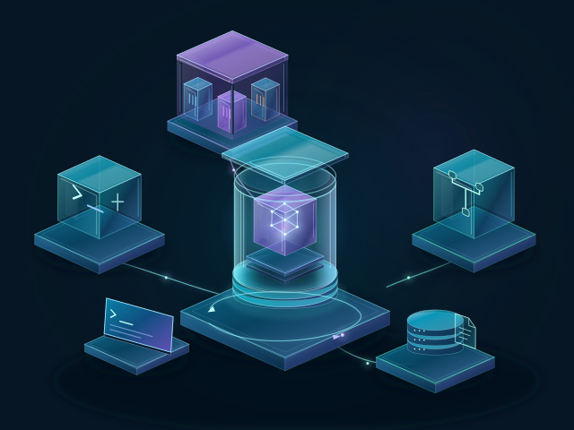
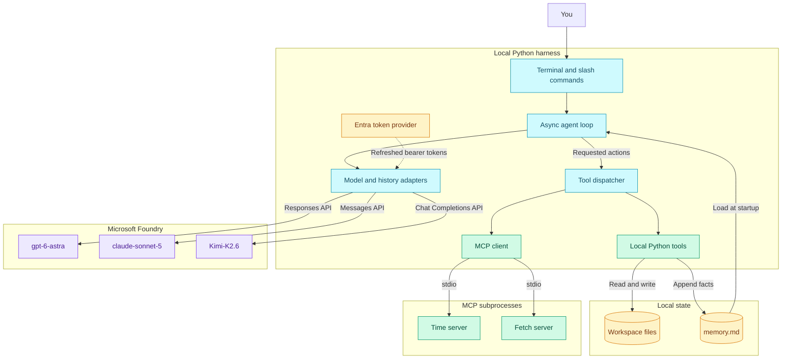
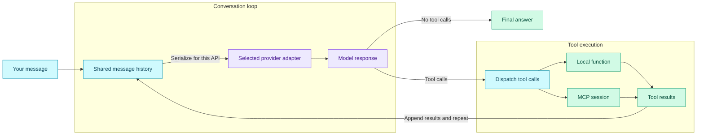

<div align="center">

# AI Agent Harness 101

**Build the loop. Connect tools. Keep memory. Switch models.**

A hands-on Python journey from one model call to a multi-model agent harness.

<p>
  
  
  
  
</p>



[Quick start](#quick-start) | [Learning path](#learning-path) | [Architecture](#architecture) | [Models](#models-and-authentication) | [Tests](#offline-tests)

</div>

---

## What you will build

The model decides what to do next. **The harness makes it happen.**

This repository builds that harness in six readable examples. Start with a
single prompt, add file tools and an execution loop, then bring in external
tools, durable memory, and model switching without resetting the conversation.

| Pillar | What it adds | How it works here |
| --- | --- | --- |
| **Tools** | Actions beyond generating text | Local Python functions plus Time and Fetch servers over MCP |
| **Memory** | Facts that survive a restart | A Markdown file loaded into the prompt and updated by a tool |
| **Models** | Different models, shared context | GPT, Claude, and Kimi through their native Foundry APIs |

No agent orchestration framework, vector database, or hidden workflow engine:
the loop, tool dispatch, and history adapters are ordinary Python you can inspect.

## Quick start

### 1. Get ready

- **Python 3.13+** and the [Azure CLI](https://learn.microsoft.com/cli/azure/install-azure-cli).
- Access to the configured **Microsoft Foundry project and deployments**.
- Model-inference permissions for your signed-in identity. See
  [models and authentication](#models-and-authentication).
- Network access for the first `uvx` launch. If your network uses a package
  mirror, configure it using [MCP setup](#mcp-setup) before starting the harness.

> [!NOTE]
> These examples point to an existing Foundry resource, not a public demo service.
> Use it only if you have access, or update the endpoint and deployment names in
> the [v5 model registry](_src/v5_harness.py) to match your own project.

### 2. Install and sign in

From the repository root, in PowerShell:

```powershell
cd .\_src
python -m venv .venv
.\.venv\Scripts\Activate.ps1
python -m pip install -r requirements.txt
az login
```

Dependencies are declared in [requirements.txt](_src/requirements.txt) and
[pyproject.toml](_src/pyproject.toml). No OpenAI or Anthropic API keys are needed.

### 3. Launch the complete harness

```powershell
python .\v5_harness.py
```

GPT is selected by default. With both MCP servers connected, the harness has
**seven tools**: four local tools, two time tools, and one fetch tool.

Try this at the prompt:

```text
/models
/tools
List the files in my workspace.
/model claude
What have we discussed so far?
/model kimi
What time is it in Sydney?
```

> [!TIP]
> Prefer to learn one concept at a time? Start with
> `python .\v0_hello.py` and follow the learning path below.

## Learning path

Each example introduces a new concept; the final harness brings them together.

| Step | Example | Focus |
| --- | --- | --- |
| **v0** | [Hello, model](_src/v0_hello.py) | A single model request with Entra authentication |
| **v1** | [File tools](_src/v1_fileTool.py) | Let the model request local file operations |
| **v2** | [The agentic loop](_src/v2_AgenticLoopFileTool.py) | Execute tool calls and repeat until the model answers |
| **v3** | [MCP integration](_src/v3_MCP.py) | Discover external tools and call them over an async connection |
| **v4** | [Persistent memory](_src/v4_Memory.py) | Save facts to disk and keep conversation history in the session |
| **v5** | [The complete harness](_src/v5_harness.py) | Switch among three models while preserving tools and context |

The v0-v4 examples use `gpt-6-astra` through the Foundry resource's OpenAI
Responses endpoint. The v5 diagrams below show the complete multi-model design.

## Architecture

### The big picture

The harness runs locally. Model inference happens in Foundry; tools and
file-backed state remain under the harness's control.

<!-- mermaid-checked: quoted labels, unique IDs, closed subgraphs, ASCII labels, no literal newline escapes -->


| Layer | Technology | Responsibility |
| --- | --- | --- |
| Execution | Python 3.13+, `asyncio`, `AsyncExitStack` | Run the loop and manage client and subprocess lifetimes |
| Models | OpenAI SDK and Anthropic SDK | Call the correct inference API for each deployment |
| Identity | Azure Identity | Acquire and refresh Microsoft Entra tokens without blocking the event loop |
| Tools | Python functions and the MCP SDK | Execute local actions and discover remote tool schemas |
| State | Pydantic messages, workspace files, Markdown memory | Track the current conversation and save selected facts |

**Two kinds of memory:** conversation history lives in the Python process;
selected facts persist in [memory.md](_src/memory.md). Restarting the harness
loads those saved facts into a new conversation, not a complete chat transcript.

### Inside one turn

A tool call is not the final answer. Its result becomes input to the next model
request, and the loop continues.

<!-- mermaid-checked: quoted labels, unique IDs, closed subgraphs, ASCII labels, no literal newline escapes -->


The adapters preserve native reasoning for replay to its originating API,
translate tool-call history between providers, and convert Kimi tool IDs into
Claude-compatible IDs. Switching models changes the adapter, not the conversation.

## Models and authentication

| Switch command | Foundry deployment | Inference API |
| --- | --- | --- |
| `/model gpt` | **gpt-6-astra** - default | OpenAI Responses |
| `/model claude` | **claude-sonnet-5** | Anthropic Messages |
| `/model kimi` | **Kimi-K2.6** | OpenAI Chat Completions |

All three v5 clients use `DefaultAzureCredential` with automatically refreshed
tokens for `https://ai.azure.com/.default`. The OpenAI SDK's `api_key` argument
receives a **token-provider function**, not a stored API key.

Your identity needs project and model-inference access, for example the
**Azure AI User / Foundry User** role at the appropriate resource and project
scopes. The earlier GPT-only examples require **Cognitive Services OpenAI User**
access to their configured resource.

<details>
<summary><strong>Endpoint routing and provider differences</strong></summary>

The configured Foundry project is:

```text
https://use-ai-foundry-demo.services.ai.azure.com/api/projects/proj-default
```

- **GPT and Kimi:** append `/openai/v1/` to that project URL.
- **Claude:** use the resource-level
  `https://use-ai-foundry-demo.services.ai.azure.com/anthropic/` endpoint.
- **v0-v4:** use the resource-level
  `https://use-ai-foundry-demo.services.ai.azure.com/openai/v1/` endpoint.

The project URL alone is not an inference URL. Deployment names must match
Foundry exactly, including capitalization.

GPT uses Responses because this deployment does not support reasoning together
with function tools on Chat Completions. Claude uses its native Messages API,
not an OpenAI compatibility endpoint. Local Ollama and direct API-key endpoints
are not part of v5.

</details>

> [!IMPORTANT]
> `DefaultAzureCredential` is convenient for local development. For an
> Azure-hosted production app, use an explicitly configured
> `ManagedIdentityCredential` and least-privilege role assignments.

## Command center

| Command | What it does |
| --- | --- |
| `/models` | List deployments and mark the currently selected model |
| `/model gpt` | Switch to GPT without clearing history |
| `/model claude` | Switch to Claude without clearing history |
| `/model kimi` | Switch to Kimi without clearing history |
| `/tools` | List local and discovered MCP tools |
| `/memory` | Display facts saved to disk |
| `/quit` | Exit the harness |

**Try an action, not just a question:**

- "List my workspace files, then read one and summarize it."
- "Remember that I prefer concise answers."
- "Convert 9 AM in Sydney to London time."

The v5 local tools are `list_files`, `read_file`, `write_file`, and `save_memory`.
The configured MCP servers add `get_current_time`, `convert_time`, and `fetch`.

## MCP setup

[mcp_servers.json](_src/mcp_servers.json) defines the Time and Fetch servers used
by v5. The v3 example declares the same servers directly in its Python file.

Both launch servers with **`uvx`**, provided by the `uv` dependency. Server
packages are installed in separate environments on demand; the first launch
needs package-download access.

<details>
<summary><strong>Using a package mirror or troubleshooting Connection closed</strong></summary>

If your network requires a package mirror, set `UV_DEFAULT_INDEX` in the
**same PowerShell terminal** before launching. Replace the placeholder with
your approved package index:

```powershell
$env:UV_DEFAULT_INDEX = "https://your-package-index.example/simple/"
python .\v5_harness.py
```

The same setting works with `python .\v3_MCP.py`. Both examples explicitly pass
the setting to subprocesses because the MCP stdio launcher does not inherit it
automatically. Leaving it unset or empty preserves `uvx`'s default behavior.

If startup reports `MCPError: Connection closed`, inspect the server's stderr
above the traceback. A failed package download or server startup can close the
connection before MCP initialization; the nested `ExceptionGroup` is not
necessarily the root cause.

</details>

## Offline tests

Run the focused [v5 harness suite](_src/tests/test_foundry_harness.py) from
[_src](_src), with the virtual environment activated:

```powershell
python -m unittest discover -s tests -p test_foundry_harness.py -v
```

The suite uses mocked HTTP and MCP transports, with no Azure requests or changes
to your workspace files. It covers:

- Entra authentication, token refresh, and authentication failures.
- Model selection and conversation history across all three APIs.
- Local and MCP tool calls, schema translation, and provider-specific reasoning.
- Invalid tool arguments, incomplete responses, and resource cleanup.

Earlier-example coverage lives in
[test_foundry_examples.py](_src/tests/test_foundry_examples.py).

## Find your way around

| Location | Purpose |
| --- | --- |
| [_src](_src) | The six progressive Python examples |
| [workspace](_src/workspace) | Files available to the local file tools |
| [memory.md](_src/memory.md) | Facts saved by the memory tool |
| [mcp_servers.json](_src/mcp_servers.json) | MCP server commands for v5 |
| [tests](_src/tests) | Offline regression tests |
| [prompt](_src/prompt) | Companion prompts and learning material |

> [!WARNING]
> This is a learning harness, not a sandbox. File tools run with your process
> permissions and can overwrite files. Use disposable workspace data and avoid
> sensitive saved memory: prompts and tool results are sent to the selected model.

## Keep exploring

- [How to Build an Agentic Harness from Scratch - Full Python Tutorial](https://www.youtube.com/watch?v=H5o1P8RMiMw&t=2063s)
- [Claude on Foundry: deployment and Entra authentication](https://learn.microsoft.com/azure/foundry/foundry-models/how-to/use-foundry-models-claude)
- [Foundry reasoning models: client setup and API usage](https://learn.microsoft.com/azure/foundry/foundry-models/how-to/use-chat-reasoning)
- [Model Context Protocol documentation](https://modelcontextprotocol.io/docs/getting-started/intro)

---

<p align="center"><strong>Start with a prompt. Finish with a harness you understand.</strong></p>